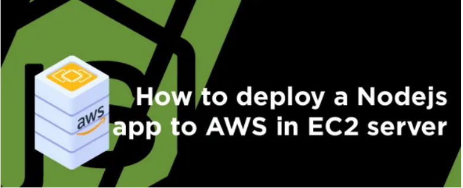

# Deploying a Node.js Application on AWS EC2 Instance



This guide walks you through deploying a Node.js application on an AWS EC2 Linux instance and accessing it in a browser.

## Steps

### 1. Create an AWS EC2 Instance

- Log in to the AWS Management Console and navigate to the EC2 dashboard.
- Launch a new EC2 instance. You can select Amazon Linux or Ubuntu as your AMI.
- For detailed steps on configuring an EC2 instance, refer to [this guide](https://link-to-your-guide).
- Once your instance is running, SSH into it using the key pair you selected during creation.

### 2. SSH into the Instance

Use the following command to SSH into the EC2 instance:

```bash
ssh -i "your-key.pem" ec2-user@your-ec2-public-ip
After connecting, switch to the superuser account:

bash
Copy code
sudo su
3. Install Node.js and NPM
Install nvm (Node Version Manager) by running the following command:
bash
Copy code
curl -o- https://raw.githubusercontent.com/nvm-sh/nvm/v0.39.3/install.sh | bash
Activate nvm:
bash
Copy code
. ~/.nvm/nvm.sh
Install Node.js (version 16 in this case):
bash
Copy code
nvm install 16
Verify installation:
bash
Copy code
node -v
npm -v
4. Install Git
Update your system:
bash
Copy code
yum update -y
Install Git:
bash
Copy code
yum install git -y
Verify Git installation:
bash
Copy code
git --version
5. Clone the Repository
Clone your Node.js application from GitHub:
bash
Copy code
git clone https://github.com/your-repository-link.git
Change directory into the cloned project:
bash
Copy code
cd your-repository
6. Install Dependencies
Install all required dependencies for your Node.js app:

bash
Copy code
npm install
7. Run the Application
Start your Node.js app using:

bash
Copy code
node index.js
8. Access the Application in Browser
Use the public IP address of your EC2 instance to access the app. Assuming your app is running on port 80:
bash
Copy code
http://your-ec2-public-ip
You can also use the public DNS:
bash
Copy code
http://ec2-your-public-dns.us-region.compute.amazonaws.com
If you encounter any issues, feel free to open an issue in the repository.

License
This project is licensed under the MIT License - see the LICENSE file for details.

Author
Your Name

vbnet
Copy code

You can adjust the repository links, author's name, and any other specific details before using it.
```
